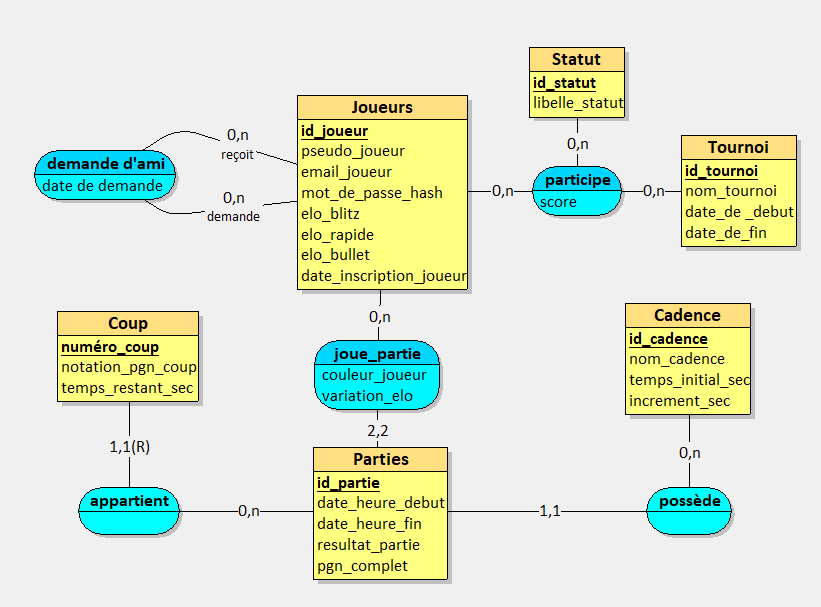

# ProjetDB_Mathieu_Chen

## Etape 1

### 1. Objectif
Refaire la base de données de Chess.com.

### 2. Prompt de départ
> **R (Rôle) :** Agis en tant qu'Architecte de Bases de Données (DBA) senior travaillant pour la plateforme Chess.com.
> 
> **I (Instructions) :** Analyse les besoins pour la refonte de la base de données du jeu. Génère une liste exhaustive de règles métier précises, puis déduis-en un dictionnaire de données complet.
> 
> **C (Contexte) :** La base doit gérer les profils des joueurs, leurs classements Elo évolutifs selon la cadence (Blitz, Rapide, Bullet), le matchmaking, l'enregistrement de l'historique des parties coup par coup, et la gestion des tournois en ligne.
> 
> **A (Contraintes Additionnelles) :** Inclus obligatoirement des règles métier qui justifieront plus tard lors de la modélisation MERISE : une dépendance fonctionnelle forte (entité faible/forte), une relation récursive (ex: système d'amis ou l'affrontement entre deux joueurs), et une relation liant au moins trois concepts (n-aire). Limite-toi à une trentaine de champs pour le dictionnaire.
> 
> **R (Références) :** Inspire-toi du fonctionnement réel de Chess.com, des formats PGN pour l'enregistrement des coups, et du système de classement Elo.
> 
> **D (Rendement Désiré) :** Fournis d'abord les règles métier sous forme de liste à puces numérotée. Ensuite, fournis le dictionnaire de données sous forme de tableau Markdown (avec les colonnes : Nom de la donnée, Type, Description).
> 
> **O (Objectifs) :** Me fournir une base de travail parfaite et normalisable pour créer un Modèle Conceptuel de Données (MCD) respectant la 3ème forme normale (3FN).

### 3. Réponse de l'IA

La conception d'une architecture robuste pour une plateforme de l'envergure de Chess.com exige une modélisation stricte. Le cœur du système doit absorber un volume massif de transactions (matchmaking en temps réel, requêtes de coups) tout en garantissant la cohérence des classements et de l'historique PGN. 

Voici les règles métier définissant le périmètre de la base de données, structurées pour une modélisation MERISE (3FN).

#### Règles Métier

1. **Gestion des profils :** Chaque joueur s'inscrit sur la plateforme avec un pseudonyme unique, une adresse email et un mot de passe.
2. **Réseau social (Relation récursive) :** Un joueur peut se lier d'amitié avec d'autres joueurs, créant une connexion directe entre deux occurrences de la même entité.
3. **Segmentation des classements :** Le niveau d'un joueur est défini par trois cotes Elo distinctes qui évoluent indépendamment (un joueur peut par exemple afficher un solide 1600 Elo en Rapide, tout en ayant des cotes différentes en Blitz et en Bullet).
4. **Typologie des cadences :** Chaque partie jouée appartient à une catégorie de cadence stricte, définie par un temps initial alloué et un incrément en secondes ajouté à chaque coup.
5. **Déroulement d'un affrontement :** Une partie oppose exactement deux joueurs. L'un conduit les pièces blanches, l'autre les pièces noires. Elle se solde par un résultat formel (Victoire Blancs, Victoire Noirs, Nul, ou En cours).
6. **Historique des coups (Entité faible) :** Une partie génère une séquence de coups chronologiques. Chaque coup (identifié par son numéro séquentiel et sa notation PGN) n'a d'existence conceptuelle qu'au sein de la partie dans laquelle il a été joué. La destruction d'une partie entraîne obligatoirement la destruction de ses coups (dépendance fonctionnelle forte).
7. **Organisation des tournois :** Un tournoi est un événement daté, possédant un nom et imposant une cadence unique à toutes les parties qui y sont rattachées.
8. **Bilan événementiel (Relation n-aire) :** À la fin d'un événement, le palmarès relie obligatoirement et simultanément trois concepts : le Joueur, le Tournoi, et un Statut de résultat (ex: Vainqueur, Finaliste, Éliminé).
9. **Impact comptable de la partie :** À l'issue de chaque match, la variation d'Elo (positive, négative ou nulle) est enregistrée pour les deux participants.

#### Dictionnaire de Données

Ce dictionnaire est restreint à une trentaine de champs essentiels pour garantir une base normalisée, expurgée des redondances.

| Nom de la donnée | Type | Description |
| :--- | :--- | :--- |
| `id_joueur` | INT (PK) | Identifiant technique unique du joueur. |
| `pseudo_joueur` | VARCHAR(50) | Pseudonyme unique affiché sur la plateforme. |
| `email_joueur` | VARCHAR(255) | Adresse courriel de contact et de connexion. |
| `mot_de_passe_hash` | VARCHAR(255) | Empreinte cryptographique du mot de passe. |
| `elo_blitz` | INT | Classement actuel du joueur sur la cadence Blitz. |
| `elo_rapide` | INT | Classement actuel du joueur sur la cadence Rapide. |
| `elo_bullet` | INT | Classement actuel du joueur sur la cadence Bullet. |
| `date_inscription_joueur` | DATETIME | Date et heure de création du compte. |
| `date_demande_ami` | DATETIME | Horodatage de la mise en relation entre deux joueurs. |
| `id_partie` | INT (PK) | Identifiant technique unique de la partie. |
| `date_heure_debut` | DATETIME | Moment exact du lancement de la partie. |
| `date_heure_fin` | DATETIME | Moment exact de la fin de la partie. |
| `resultat_partie` | VARCHAR(10) | Issue du match (ex: "1-0", "0-1", "1/2-1/2", "*"). |
| `pgn_complet` | TEXT | Transcription textuelle complète de la partie au format PGN. |
| `couleur_joueur` | CHAR(1) | Attribut de l'association Jouer ('B' pour Blanc, 'N' pour Noir). |
| `variation_elo` | INT | Points gagnés ou perdus par un joueur suite à une partie. |
| `id_cadence` | INT (PK) | Identifiant technique de la configuration de temps. |
| `nom_cadence` | VARCHAR(30) | Libellé de la cadence (ex: "Blitz 3+2"). |
| `temps_initial_sec` | INT | Temps de réflexion de base accordé par joueur (en secondes). |
| `increment_sec` | INT | Temps ajouté à l'horloge après chaque coup (en secondes). |
| `numero_coup` | INT | Identifiant relatif du coup au sein d'une partie spécifique. |
| `notation_pgn_coup` | VARCHAR(10) | Notation algébrique du coup joué (ex: "Nf3", "O-O-O"). |
| `temps_restant_sec` | INT | Temps de réflexion restant au joueur après avoir joué ce coup. |
| `id_tournoi` | INT (PK) | Identifiant technique unique du tournoi. |
| `nom_tournoi` | VARCHAR(100) | Appellation publique de l'événement. |
| `date_debut_tournoi` | DATETIME | Lancement officiel des rondes du tournoi. |
| `date_fin_tournoi` | DATETIME | Clôture de l'événement. |
| `id_statut` | INT (PK) | Identifiant technique du palmarès/statut. |
| `libelle_statut` | VARCHAR(50) | Désignation du statut (ex: "Vainqueur", "Top 10%"). |
| `score_tournoi_joueur` | DECIMAL(5,1) | Points cumulés par un joueur lors d'un tournoi spécifique. |

---

## Etape 2

